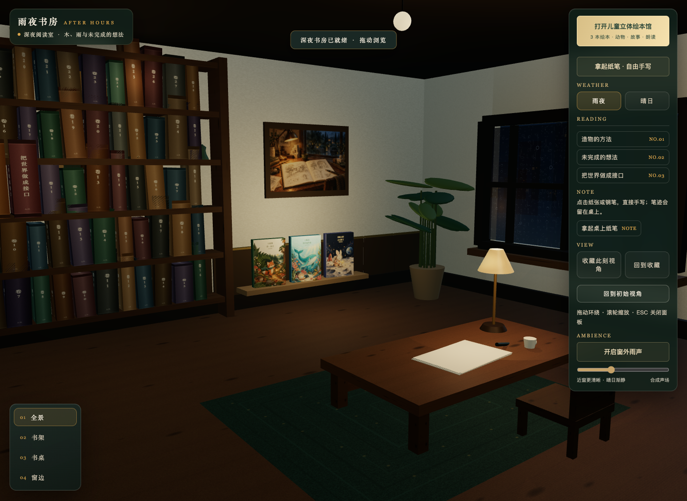
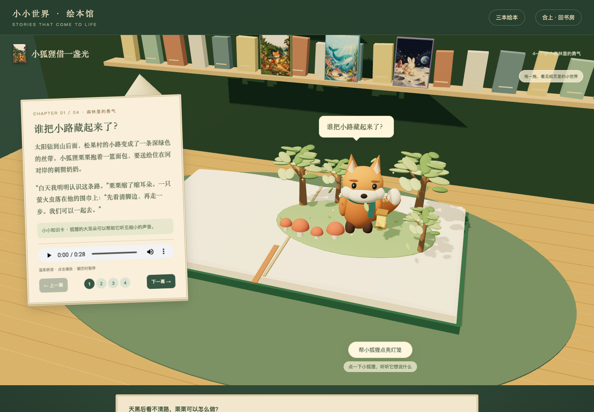
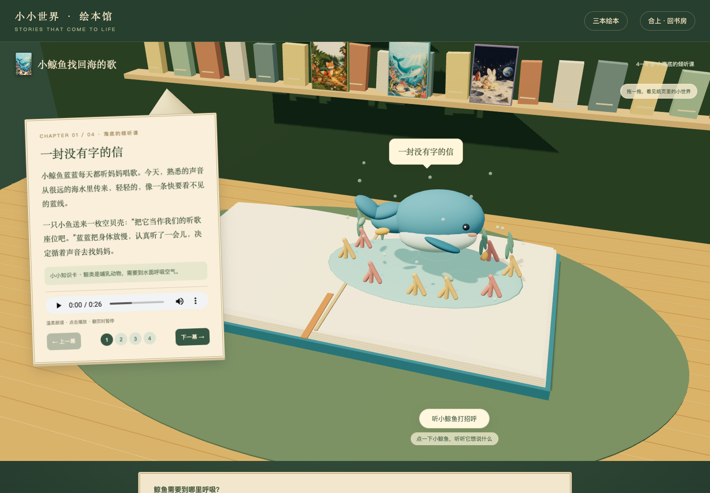
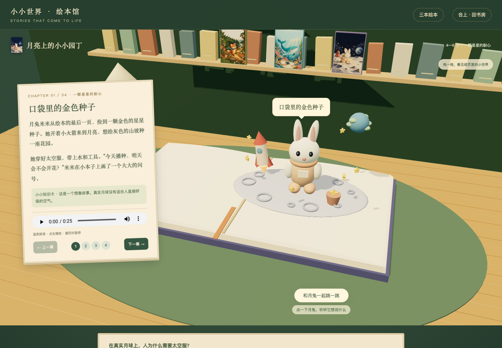
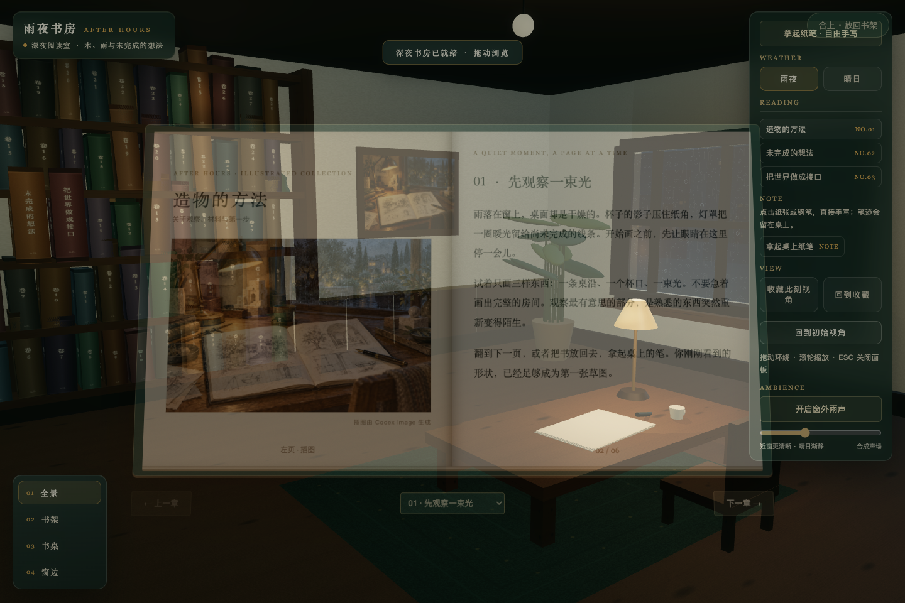
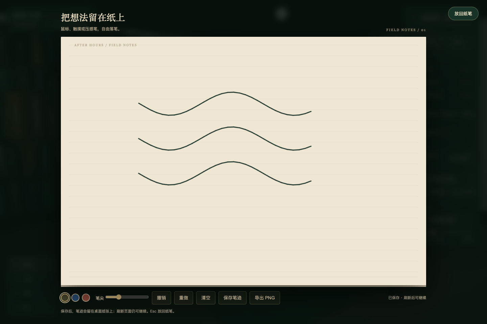

<div align="center">

# 雨夜书房 · AFTER HOURS

### 把书翻开，把想法留下。

一个可以读书、手写、听故事的浏览器 3D 小世界。

**简体中文** · [English](README.en.md)

[进入书房](https://andyhuo520.github.io/rainy-study/) · [打开立体绘本](https://andyhuo520.github.io/rainy-study/?library=children) · [观看演示](docs/demo.mp4)

**6 本可读书籍 · 12 幕立体故事 · 自由手写 · 无需 API Key**

</div>



窗外下着雨，桌上亮着暖灯。选一个舒服的角度，从书架拿下一本书，翻开故事；或者拿起纸笔，留下几笔涂鸦。关闭纸面后，笔迹会回到桌上的那张纸，下一次打开仍然保留。

> 下方均为本项目的实际运行截图。书内插图与封面包含 AI 生成素材；README 没有用概念图代替产品截图。演示视频为无声录屏，应用内可播放中文朗读。

## 先翻开一本书


| 小狐狸借一盏光 | 小鲸鱼找回海的歌 |
| :---: | :---: |
|  |  |
| 穿过森林，把面包送给刺猬奶奶。灯笼摇晃，树叶飘落，萤火围绕。 | 跟随歌声游过海底。鲸鱼摆尾，小鱼巡游，气泡缓缓上升。 |



**《月亮上的小小园丁》**：跟米米练习低重力跳跃，照顾一颗童话种子，等待星光花园。

每本绘本都有四幕故事、中文朗读、知识卡和互动提问。点击动物会出现章节对白；拖动可以换角度观察。翻页时，立体物先收回纸面，纸页翻过去，下一幕再立起来。

## 也可以安静地读和画

| 翻阅普通书籍 | 拿起纸笔自由手写 |
| :---: | :---: |
|  |  |
| 三本书，每本三章。取出、翻页、阅读，再放回书架。 | 换颜色、调粗细、撤销与重做。保存笔迹，或导出 PNG。 |

## 交互一览

| 体验 | 可以做什么 |
| --- | --- |
| 探索书房 | 拖动环绕、滚轮缩放；全景、书架、书桌、窗边四个机位 |
| 收藏构图 | 保存当前视角，刷新后恢复 |
| 切换天气 | 雨夜与晴日联动窗景、照明和雨滴；雨声可手动开启 |
| 阅读书籍 | 六本书，共二十一章或幕；包含三本动态立体绘本 |
| 听故事 | 十二段预生成中文 Edge TTS 朗读，翻页时停止上一段 |
| 留下笔迹 | 鼠标或触摸手写，保存到桌面纸张，导出图片 |
| 退出阅读 | 使用关闭按钮或 Esc；移动端提供触摸入口 |

界面与故事内容目前为中文。笔迹、章节进度、答案和收藏只保存在当前浏览器，不跨设备同步。

## 本地启动

推荐 Node.js 24；支持 Node.js 20.19+ 或 22.12+。

```sh
git clone https://github.com/andyhuo520/rainy-study.git
cd rainy-study
npm ci
npm run dev
```

打开终端给出的本地地址。直接进入绘本馆时，在地址后加 `?library=children`。

**不需要 API key，也不需要运行模型服务。** 三维场景由浏览器渲染，插画和音频随仓库提供。

```sh
npm run build
npm run preview
```

生产文件输出到 `dist/`。资源使用相对路径，可部署到 GitHub Pages 等静态托管服务。本仓库的源码在 `main`，线上文件在 `gh-pages`；重新构建并把 `dist/` 内容提交到 `gh-pages` 即可更新网站。

## 实现与来源

| 部分 | 使用方式 |
| --- | --- |
| 场景与交互 | Three.js、原生 JavaScript、CSS 动画 |
| 开发与构建 | Vite |
| 手写与纹理 | Canvas、浏览器本地存储 |
| 书籍插画 | Image 生成的封面与内页素材 |
| 故事朗读 | Edge TTS 晓晓，预生成 MP3 |

项目起于一次 [Atria Dawn Preview](https://github.com/atria-asi/Atria-Dawn-Preview) 的 AI coding 实测。Atria 通过 API 生成初版书房主体和多轮补丁；Codex 组织运行、反馈与验证，并对墙体和事件选择器等位置直接收尾。

后续取放阅读、手写、玻璃雨滴、立体绘本、动态场景和部署由 Codex 实现。因此，完整成品不能全部归因于 Atria 独立生成。本项目是独立体验作品，不属于 Atria 官方，也不是跨模型基准评测。

## 当前边界

- 浏览器内的 3D 立体绘本，没有摄像头和现实空间定位 AR。
- 提供环绕观察与预设机位，没有第一人称行走和碰撞系统。
- 月球种植为童话设定，动物、雨滴与声音采用风格化模拟。
- 已检查桌面和 390px 移动布局及主要交互，尚未完成所有设备、长期性能和真实儿童使用研究。
- 音频需要用户点击后播放；清理浏览器站点数据会清除本地进度和笔迹。

## 许可

项目自有代码使用 [MIT License](LICENSE)，依赖保留各自许可证。AI 生成插图和合成音频随项目提供作展示与修改参考，不代表第三方模型或服务品牌的授权或背书。

如果你用它做出了另一间房间、一本新绘本，欢迎在 [Issues](https://github.com/andyhuo520/rainy-study/issues) 分享。
